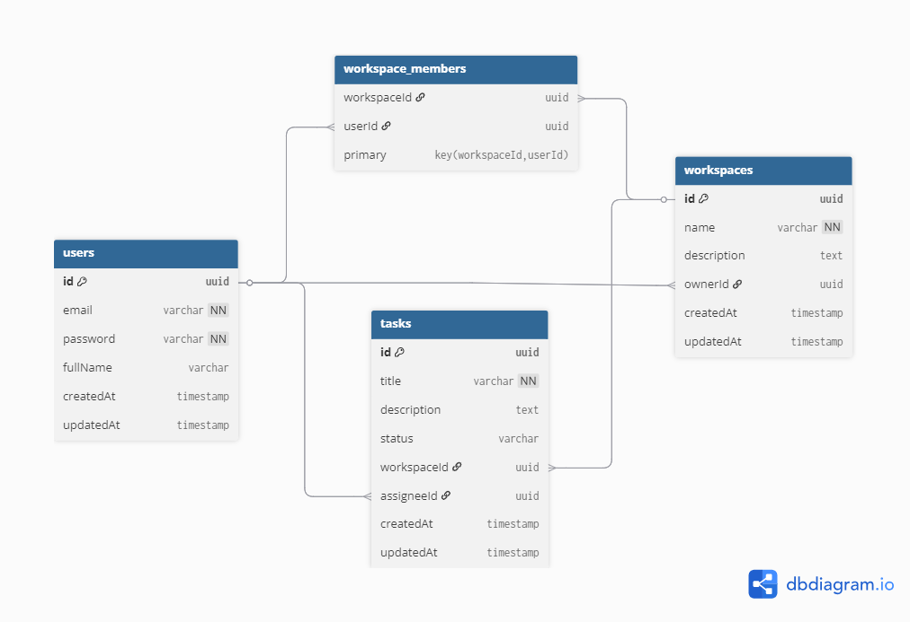
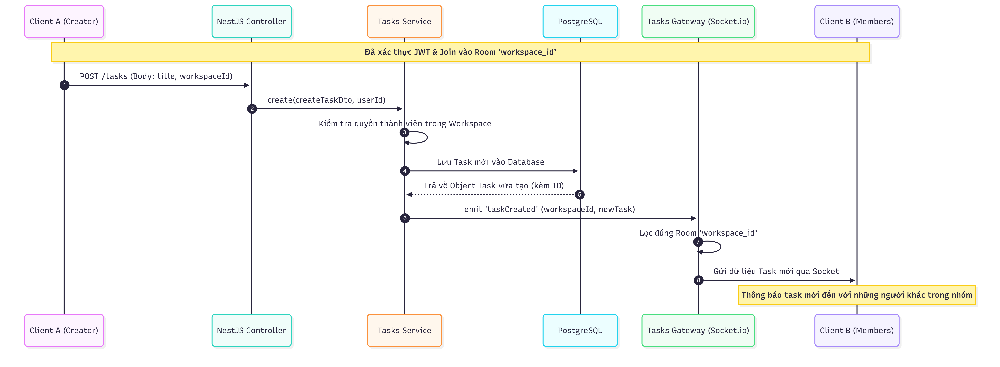
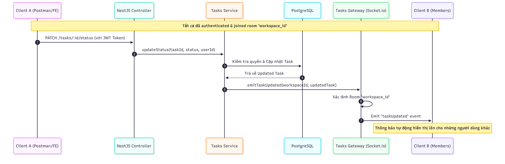
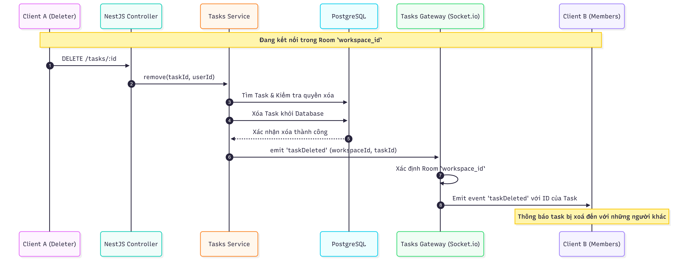

# Realtime Task Collaboration System (Backend)

hệ thống quản lý công việc theo thời gian thực (Realtime Task
Collaboration System) dành cho các nhóm nhỏ. Hệ thống cho phép nhiều người dùng cùng tham gia vào một workspace và tương tác với các task theo thời gian thực.

# Công Nghệ Sử Dụng

- **Framework:** NestJS (Node.js) - Đảm bảo tính mở rộng và cấu trúc module rõ ràng.
- **Database:** PostgreSQL & TypeORM - Quản lý dữ liệu quan hệ và nhất quán.
- **Realtime:** Socket.io - Xử lý truyền tải dữ liệu thời gian thực.
- **Authentication:** Passport JWT - Xác thực và phân quyền người dùng.
- **Validation:** Class-validator & Class-transformer - Kiểm tra tính hợp lệ của dữ liệu từ Client.

# Kiến Trúc Hệ Thống

Hệ thống được thiết kế theo kiến trúc Module-based của NestJS, chia thành các thành phần chính:

1. Auth Module: Xử lý Đăng ký, Đăng nhập và bảo mật thông qua JWT.
2. Workspace Module: Quản lý không gian làm việc và thành viên.
3. Tasks Module: Thực hiện các thao tác CRUD task và tích hợp WebSocket Gateway để thông báo thay đổi.
4. Realtime Isolation: Sử dụng cơ chế Socket.io Rooms để cô lập sự kiện theo từng Workspace ID, đảm bảo người dùng không nhận nhầm dữ liệu từ các không gian làm việc khác.

# Sơ Đồ Hệ Thống

## 1. Sơ đồ Database (ERD)

Sơ đồ mô tả mối quan hệ giữa Người dùng, Workspace và các Task.


## 2. Luồng Real-time (Sequence Diagrams)

Các sơ đồ dưới đây mô tả cách dữ liệu được cập nhật tức thời tới các thành viên trong Workspace.

### Luồng Tạo Task mới:



### Luồng Cập nhật trạng thái Task:



### Luồng Xóa Task:



# Bảo Mật & Xác Thực

- JWT Guard: Tất cả các API REST và kết nối WebSocket đều yêu cầu Token hợp lệ.
- Permission Check: Hệ thống luôn kiểm tra người dùng có phải là thành viên của Workspace hay không trước khi thực hiện bất kỳ thao tác thay đổi dữ liệu nào.
- Data Sanitization: Tuyệt đối không trả về các thông tin nhạy cảm (như password) trong các API Response.

# Hướng Dẫn Chạy Project

## 1. Hệ thống sử dụng

- Node.js (v22.20.0)
- PostgreSQL 18
- VS Code

## 2. Cài đặt

- Clone hoặc Download trực tiếp từ Github về.
- Mở VS Code vào thư mục `Task1_Realtime-Task-Collaboration-System`.
- Chạy lệnh `npm install` để cài đặt những thư viện cần thiết.

## 3. Cấu hình Biến môi trường

Tạo file .env tại thư mục gốc và cấu hình các thông số sau:

```
DB_HOST=localhost
DB_PORT=5432
DB_USERNAME=postgres
DB_PASSWORD=your_password (mật khẩu postgres của bạn)
DB_NAME=task_management (tạo database có tên y hệt hoặc tự đặt tên)
JWT_SECRET=your_super_secret_key (tự tạo một super_secret_key)
PORT=3000
```

Có thể tự tạo super_secret_key trên trang web này https://jwtsecretkeygenerator.com/

## 4. Khởi chạy

Sau khi đã hoàn tất hết tất cả phần cài đặt.

Khởi chạy dự án ở chế độ phát triển bằng lệnh `npm run start:dev`

Hệ thống sẽ chạy tại: http://localhost:3000 và WebSocket tại cổng tương ứng.

## 5. Tài liệu API

| Method   | Endpoint            | Chức năng                     | Dữ liệu đầu vào (Body/Param)          |
| :------- | :------------------ | :---------------------------- | :------------------------------------ |
| `POST`   | `/auth/register`    | Đăng ký tài khoản mới         | `email`, `password`, `fullName`       |
| `POST`   | `/auth/login`       | Đăng nhập hệ thống            | `email`, `password`                   |
| `POST`   | `/workspaces`       | Tạo không gian làm việc       | `name`, `description`                 |
| `GET`    | `/workspaces`       | Danh sách không gian làm việc | (Không có)                            |
| `POST`   | `/tasks`            | Tạo mới một công việc         | `workspaceId`, `title`, `description` |
| `PATCH`  | `/tasks/:id/status` | Cập nhật trạng thái task      | `id` (Param), `status`                |
| `DELETE` | `/tasks/:id`        | Xóa task khỏi hệ thống        | `id` (Param)                          |
